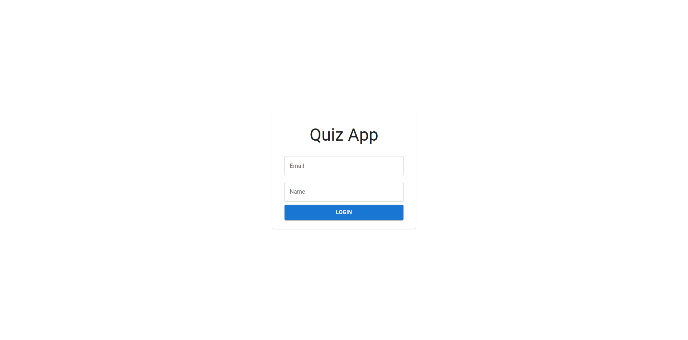
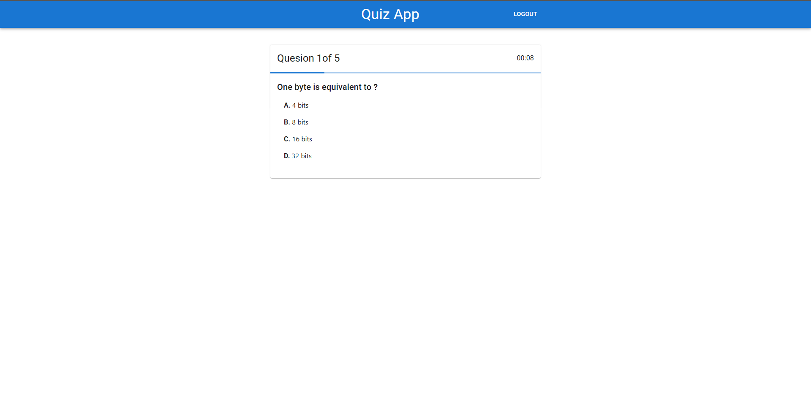
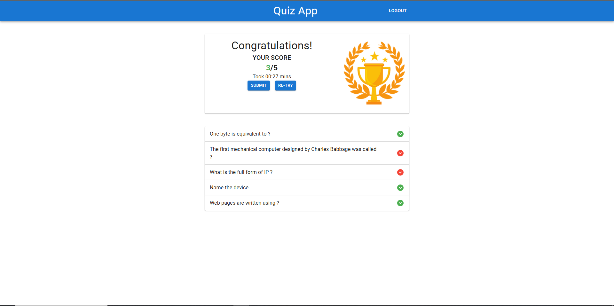

# 🧠 Quiz Application

A full-stack web application designed for interactive quizzes, built with React for the frontend and ASP.NET Core Web API for the backend. Users can log in, take a timed quiz, view their results, and track their scores.

## ✨ Features

### Frontend
*   **User Login**: Simple login interface requiring an email and name.
*   **Interactive Quiz**: Presents 5 random questions with multiple-choice options.
*   **Question Images**: Supports displaying images alongside questions.
*   **Real-time Timer**: Tracks the time taken to complete the quiz.
*   **Progress Indicator**: Shows quiz progression.
*   **Result Summary**: Displays the user's score and time taken upon completion.
*   **Score Submission**: Allows users to submit their scores to the backend.
*   **Quiz Review**: Provides a detailed breakdown of answers, highlighting correct and incorrect choices.
*   **Re-try Option**: Users can retake the quiz after viewing results.
*   **Logout Functionality**: Clears session data and returns to the login page.
*   **Responsive UI**: Built with Material-UI for a modern and adaptive user experience.
*   **Global State Management**: Utilizes React Context API with local storage for persistent session data (participant ID, selected answers, time taken).

### Backend
*   **Participant Management**:
    *   Registers new participants or retrieves existing ones based on name and email.
    *   Updates participant scores and time taken after quiz completion.
*   **Question Management**:
    *   Retrieves 5 random questions for the quiz, excluding the correct answer initially.
    *   Provides a dedicated endpoint to fetch correct answers for a given set of question IDs to calculate results securely.
*   **Image Hosting**: Serves question-related images as static files.
*   **RESTful API**: Clean and well-structured API endpoints for frontend interaction.
*   **Database Integration**: Uses Entity Framework Core with SQL Server for data persistence.

## 🚀 Technologies Used

### Frontend (React)
*   **React**: A JavaScript library for building user interfaces.
*   **React Router DOM**: For declarative routing.
*   **Material-UI (MUI)**: A popular React UI framework for sleek and responsive components.
*   **Axios**: Promise-based HTTP client for the browser and Node.js.
*   **Custom Hooks**: For managing form state (`useForm`) and application context (`useStateContext`).

### Backend (ASP.NET Core Web API)
*   **ASP.NET Core 8**: A cross-platform, high-performance, open-source framework for building modern, cloud-enabled, internet-connected apps.
*   **C#**: The primary programming language.
*   **Entity Framework Core**: An object-relational mapper (ORM) for data access.
*   **SQL Server**: Relational database management system.
*   **CORS**: Configured to allow requests from the React frontend.

## 📋 Prerequisites

Before you begin, ensure you have the following installed on your system:

*   **Node.js** (LTS version recommended) & **npm** (comes with Node.js) or **yarn**.
*   **.NET SDK** (e.g., .NET 8.0 SDK).
*   **SQL Server** (or SQL Server Express, or Docker Desktop with SQL Server image) for the database.
*   A code editor like [Visual Studio Code](https://code.visualstudio.com/) or [Visual Studio](https://visualstudio.microsoft.com/).

## ⚙️ Setup Instructions

Follow these steps to get the project up and running on your local machine.

### 1. Clone the Repository

```bash
git clone https://github.com/Adam556678/quiz-app
cd quiz-app

## 2. Backend Setup

Navigate to the backend project directory (e.g., `backend/QuizAPI`).

### a. Database Configuration

Open the `appsettings.json` file in the backend project.  
Update the **DevConnection** connection string to point to your SQL Server instance.

```json
{
  "Logging": {
    "LogLevel": {
      "Default": "Information",
      "Microsoft.AspNetCore": "Warning"
    }
  },
  "AllowedHosts": "*",
  "ConnectionStrings": {
    "DevConnection": "Server=(localdb)\\mssqllocaldb;Database=QuizDB;Trusted_Connection=True;MultipleActiveResultSets=true"
  }
}
```

- If using SQL Server Express, it might be: `Server=.\SQLEXPRESS;...`
- If using a specific SQL Server instance, replace `(localdb)\\mssqllocaldb` with your server name/instance.

### b. Apply Migrations (if database doesn't exist or needs updates)

If you need to create the DB schema or apply pending migrations, run the following commands **inside the backend project directory**:

```bash
dotnet ef migrations add InitialCreate
dotnet ef database update
```

> **Note:**  
> If you already have an existing database with the correct schema, you can skip this step.  
> The backend expects **Participants** and **Questions** tables.

### c. Seed Data (Optional)

You might want to manually insert some questions into your `Questions` table in the **QuizDB** database for testing.

Example SQL insert:

```sql
INSERT INTO Questions (QnInWords, ImageName, Option1, Option2, Option3, Option4, Answer) VALUES
('What is the capital of France?', NULL, 'Berlin', 'Madrid', 'Paris', 'Rome', 2),
('Which planet is known as the Red Planet?', NULL, 'Earth', 'Mars', 'Jupiter', 'Venus', 1),
('What is 2 + 2?', NULL, '3', '4', '5', '6', 1),
('Who painted the Mona Lisa?', NULL, 'Vincent van Gogh', 'Pablo Picasso', 'Leonardo da Vinci', 'Claude Monet', 2),
('What is the largest ocean on Earth?', NULL, 'Atlantic Ocean', 'Indian Ocean', 'Arctic Ocean', 'Pacific Ocean', 3);
-- Add more questions as needed
```

### d. Run the Backend API

```bash
dotnet run
```

The API should start and typically run on:

```
http://localhost:5175/
```

Keep this terminal open.

---

## 3. Frontend Setup

Navigate to the frontend project directory (e.g., `frontend`).

### a. Install Dependencies

```bash
npm install
# or
yarn install
```

### b. Run the Frontend Application

```bash
npm start
# or
yarn start
```

The React development server should run at:

```
http://localhost:3000/
```

---

## 🎮 Usage

- **Login**: On the home page (`http://localhost:3000/`), enter your email and name, then click **Login**.
- **Take Quiz**: You'll be redirected to the quiz page with 5 questions.
- **View Results**: After finishing the quiz, you’ll see the score and time taken.
- **Submit Score**: Click **Submit** to save your score to the database.
- **Review Answers**: See the correct answers + your selections.
- **Re-try**: Click **Re-try** to take the quiz again.
- **Logout**: Returns to the login screen and resets session data.

---


## 📸 Screenshots

### Login Page


### Quiz Page


### Results Page  
 

---

## 🤝 Contributing

Contributions are welcome!  
If you have ideas, bug reports, or improvements, feel free to create an issue or open a pull request.
